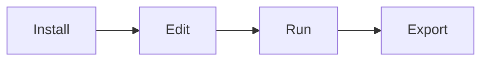
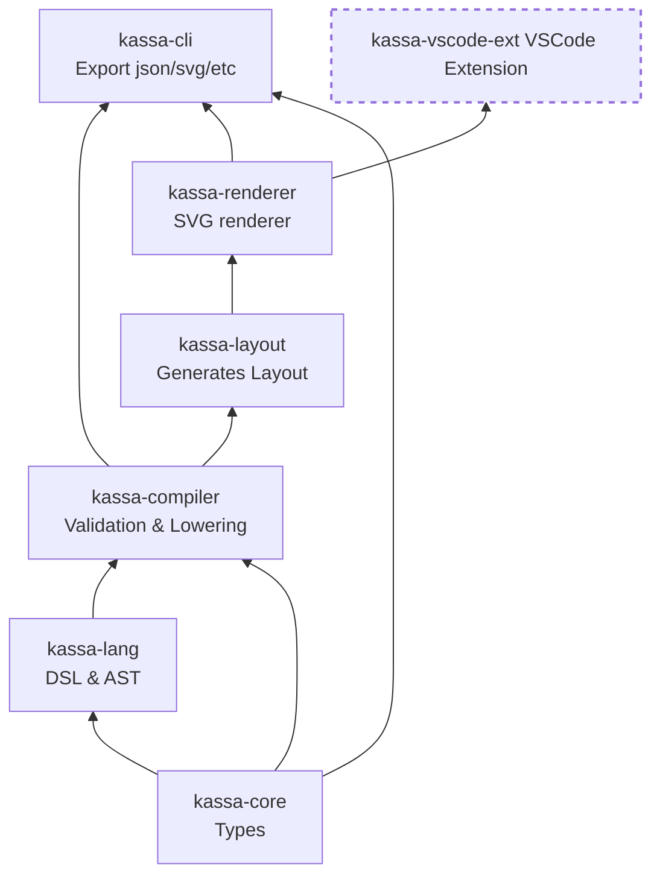

# kassa
Kassa is a schematic editor for plumbing and instrumentation diagrams (P&amp;ID)

https://karlparks.com/kassa/

# User Flows
Basic designer flow:

Expecations:
- Find cool idea online (hello there)
- Install VS Code and the Kassa VS Code Extension
- Create new Kassa project with `Kassa: New Project`
- Run the debugger via F5 (starts compiler and opens preview)
- Edit `.kassa` file, save, and watch the preview refresh
- Export svg as needed

# Development
## Installation
- https://pnpm.io/installation
- `pnpm install`

## Everyday
- `pnpm build`
- `kassa check ./examples/hello.kassa`

## Flowchart
Package organization scaffold status for MVP.
Current goal: each one has a working "build" command.

Later details:
- kassa-website (basic typescript)
- kassa-runtime/kassa-runtime-server (rust?, data bindings support)
- kassa-app (tauri/rust, data bindings support)
- kassa-ui (svelte/typescript)
