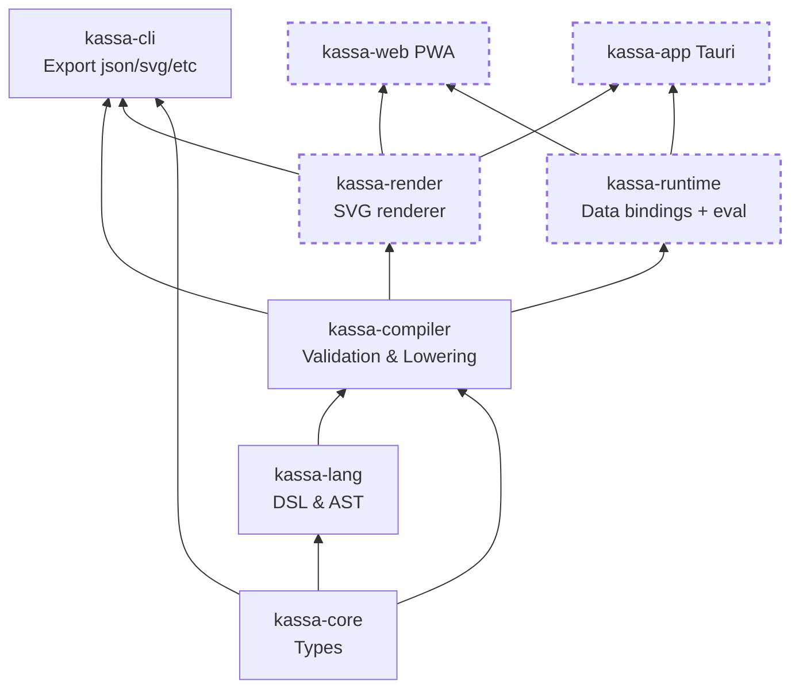

# kassa
Kassa is a schematic editor for plumbing and instrumentation diagrams (P&amp;ID)

https://karlparks.com/kassa/

# Development
Package organization scaffold status

```mermaid
flowchart BT
    core[kassa-core<br/>Types]
    lang[kassa-lang<br/>DSL & AST]
    compiler[kassa-compiler<br/>Validation & Lowering]
    runtime[kassa-runtime<br/>Data bindings + eval]
    render[kassa-render<br/>SVG renderer]
    cli[kassa-cli<br/>Export json/svg/etc]
    web[kassa-web PWA]
    app[kassa-app Tauri]

    core --> lang
    lang --> compiler
    core --> compiler

    compiler --> render
    compiler --> runtime
    compiler --> cli

    render --> cli
    core --> cli

    render --> web
    runtime --> web

    render --> app
    runtime --> app


    classDef todo stroke-width:2px,stroke-dasharray:5 5;

    class runtime todo
    class render todo
    class web todo
    class app todo
```