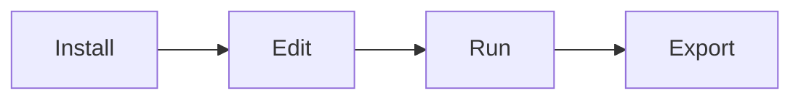
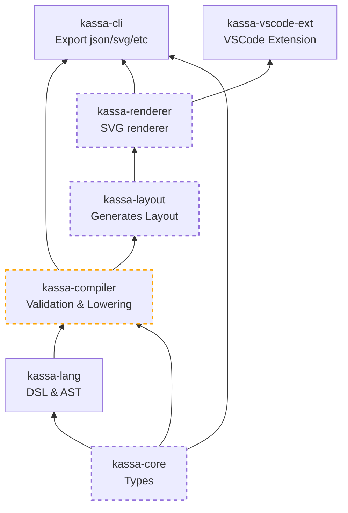

# kassa
Kassa is a modern schematic editor for plumbing and instrumentation diagrams (P&amp;ID)

https://karlparks.com/kassa/

# User Flows
## 1 - Primary
Primary **local** designer flow:

Expecations:
- Find cool idea online and now you are here... hello there ;)
- Install VS Code and the Kassa VS Code Extension
- Create new Kassa project with `Kassa: New Project`
- Run the debugger via F5 (starts compiler and opens preview)
- Edit `.kassa` file, save, and watch the preview refresh
- Export svg as needed

## 2 - App
TODO

## 3 - Browser
TODO

# Development
## Installation
- Close this repo
- Install pnpm https://pnpm.io/installation
- `pnpm install`

## Everyday cli
- `pnpm kassa check ./examples/hello.kassa`
- `pnpm kassa compile ./examples/hello.kassa`
- `pnpm kassa render ./examples/hello.kassa`

Use `pnpm -s kassa:raw` to skip build and hide pnpm context.

## Everyday editing with the VSCode Extension
- `pnpm build`
- F5

## Flowchart
Repo organization status for MVP.
Current goal: make compiler output real

Later details:
- kassa-website (basic typescript)
- kassa-runtime/kassa-runtime-server (rust?, data bindings support)
- kassa-app (tauri/rust, data bindings support)
- kassa-ui (svelte/typescript)
